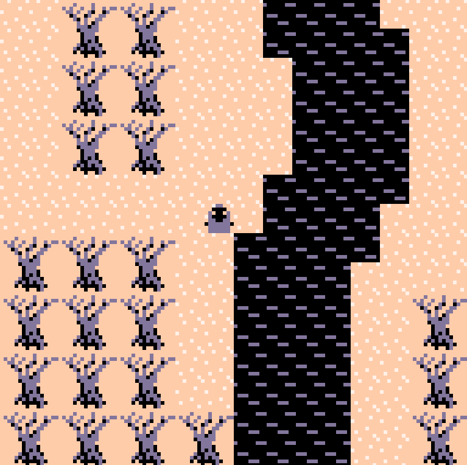

# World of Pico



## Try the [demo!](https://hypothete.com/projects/2019/world-of-pico/)

World of Pico uses the PICO-8 GPIO pins to transfer map data to the client from a Javascript source. This lets servers provide linked maps to the player, essentially allowing for unlimited map size for a PICO-8 game.

## Running it locally

Clone the project to your computer, then in the directory start a local server. I like using the npm package [http-server](https://www.npmjs.com/package/http-server) installed globally, so I can say `http-server -p 3333` on the command line in the folder, and then navigate to [localhost:3333](http://localhost:3333).

## How it works

On the JavaScript side in app.js we store several Map objects. These maps encode tile layouts for the cart to render. They also have properties like their width and height, and an array of "warps" that move the player to new maps.

```javascript

  // the indoors map

  maps.push(new Map(
    1, // ID
    12, // width
    8, // height
    [ // data
      2, 2, 2, 2, 2, 2, 2, 2, 2, 2, 2, 2,
      2, 6, 6, 2, 2, 2, 2, 2, 2, 6, 6, 2,
      2, 2, 2, 2, 2, 2, 2, 2, 2, 2, 2, 2,
      11,15,11,11,11,11,13,14,11,11,11,11,
      11,11,11,11,11,11,11,11,11,11,11,11,
      11,12,11,11,11,11,11,11,11,11,11,11,
      11,11,11,11,11,11,11,11,11,11,11,11,
      11,11,11,11,11,1, 1, 11,11,11,11,11,
    ]
  ));

  // the door to the outside
  // arguments are x, y, target map id, target x, target y
  maps[1].addWarp(5,7,0,6,9);
  maps[1].addWarp(6,7,0,6,9);
```

Using a scheme similar to P8T[1], communication between the cart and app.js occur by means of modes on GPIO pin 0. The cart has 2 states: "loading" and "game". If the cart enters the loading state, it polls pin 0 for mode updates and data on the remaining pins.

Here are the values used to flag different states and data transfer modes on pin 0:

```javascript
  /*
    pin0 modes
    0 idle
    1 map request (pin1 mapid)
    2 sending map dimensions (pin1 w pin2 h)
    3 map data request
    4 sending map data (pin1 - pin65)
    5 warp request
    6 sending warp (pin1 x pin2 y pin3 id pin4 tx pin5 ty)
    7 done
  */
```

The JS app and the cart go back and forth, updating pin 0 in turn until there is no more data to send from the app. The game then resumes the "game" state, and the player is presented with a new map.

## Ideas for future development

- Load maps from JSON
- Provide a server for maps
- Allow for client-side map manipulation. This could open up some semblance of multiplayer.
- GUI map editor using `export worldofpico.png` and a JS app using an html canvas

## References

1. [P8T by seleb](https://www.lexaloffle.com/bbs/?tid=3909)
2. [Picar.io by Vertex](https://www.lexaloffle.com/bbs/?tid=30059)